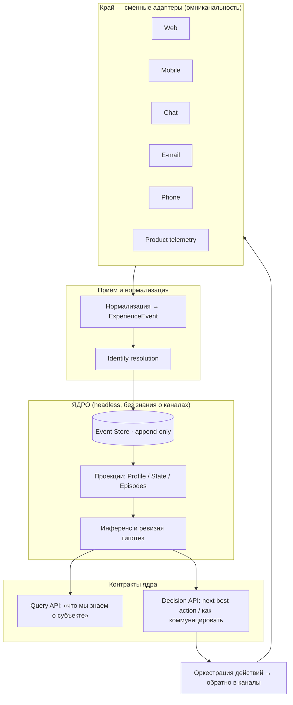
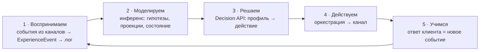
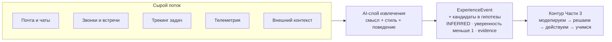

# Client eXperience Management (CXM)
## Концепция клиентского опыта и архитектура headless‑ядра

> CRM смотрит из компании наружу: воронка, сделки, наши касания, наши задачи.
> **CXM смотрит глазами клиента**: что он проживает, чего ждал, что почувствовал, что запомнил и как на основании этого решает.
> Это инверсия точки зрения. Она определяет, какие факты вообще имеет смысл копить и как их хранить.

Документ состоит из шести частей:

1. **Анатомия клиентского опыта** — из чего он состоит и какие факты к нему относятся.
2. **Отражение в системе** — как это лечь в headless‑ядро, готовое к омниканальности.
3. **Как ядро отслеживает опыт и принимает решения** — статические структуры в движении, замкнутый контур.
4. **Что вытащить с помощью AI** — наполнение контура из сырого потока коммуникаций.
5. **Линии взаимодействия как протоколы** — конкурентные процессы и их отклонения.
6. **Порядок внедрения** — как строить это поэтапно, не дожидаясь «всего сразу».

Части идут от смысла к механике: *что копим* (1) → *где это живёт* (2) → *как это работает* (3) → *откуда берётся* (4) → *по каким руслам течёт* (5) → *как это строить* (6). В конце — глоссарий.

---

# Часть 1. Анатомия клиентского опыта

## 0. Несущие принципы

Шесть идей, которые меняют всю модель данных ещё до того, как мы начнём перечислять поля.

### 0.1. Факт ≠ гипотеза ≠ состояние ≠ черта
В системе должны жить разные **эпистемические типы** записей, и их нельзя смешивать:

- **Наблюдаемый факт** — жёсткий, объективный («открыл тикет №123 14 марта», «использовал фичу X 40 раз»).
- **Гипотеза / вывод** — мягкий, с уровнем уверенности и, главное, **опровержимый** («предположительно ценит надёжность выше цены — уверенность 0.6»). Следующие взаимодействия её подтверждают или опровергают.
- **Состояние** — сиюминутное и быстро устаревающее (настроение, текущая срочность, раздражение из‑за конкретного инцидента).
- **Черта** — стабильное и медленно меняющееся (ценности, метапрограммы, стратегия убеждения).

Состояние и черта — разные горизонты обновления, и обновляются они с разной скоростью.

### 0.2. Опыт = восприятие − ожидание
Удовлетворённость рождается из **разрыва** между тем, что человек ожидал, и тем, что получил. Поэтому «ожидания» — это полноценная категория фактов, а не приправа. Фиксируя только то, что мы *сделали*, мы управляем половиной уравнения.

### 0.3. Опыт живёт в памяти, а не в моменте
Будущее поведение определяет **запомненный** опыт, а он систематически искажён: люди помнят **пик** (самый яркий момент, плюс или минус) и **концовку**, а не среднее по всем касаниям. Значит, эмоциональные пики и последнее взаимодействие нужно хранить и взвешивать отдельно.

### 0.4. Заявленное ≠ выявленное
Что клиент *сказал* о себе (заявленные предпочтения) часто расходится с тем, что видно по *поведению* (выявленные предпочтения). Обе ветки ценны, а **конфликт между ними** — сам по себе сильный сигнал.

### 0.5. Опыт со‑производится внутренней цепочкой — но внутренний контур подчинён внешнему
Внешний клиент получает не сумму отделов, а **качество стыков между ними**: он, по сути, «переживает оргструктуру» (отголосок закона Конвея). Цепочка *продажи → онбординг → поддержка → продукт* со‑производит опыт, и клиент чувствует **худший шов**, а не среднее. Поэтому моменты истины часто сидят ровно на хэндоффах.

Отсюда соблазн принципа «следующий отдел — твой клиент» (後工程はお客様, Toyota). Он полезен, но в **примитивном виде опасен**: если каждый отдел оптимизирует только своего непосредственного внутреннего соседа, цепочка дружно «уезжает» от реального внешнего клиента — классическая ловушка локальной оптимизации. Поэтому внутренний контур вводится **только вместе с механизмом подчинения**: внешний субъект остаётся точкой отсчёта (*true north*), а отношения отделов между собой — управляемый подчинённый контур, а не самоцель. Как это контролируется технически — §8 Части 2.

### 0.6. Опыт со‑производится и другими клиентами (peer‑контур)
Там, где у продукта есть сообщество — форум, чат, комьюнити, совместные события, — львиную долю опыта участника формируют **не наши действия, а другие клиенты**: их посты, ответы, помощь, признание. Вплоть до того, что поддержка со‑производится сообществом: участники отвечают друг другу раньше и охотнее сотрудников. Это третья конфигурация взаимодействия после «компания ↔ клиент» и «отдел ↔ отдел»: **клиент ↔ клиент**. Принципиальное отличие от первых двух: этот контур мы контролируем лишь **косвенно** — модерацией, механиками и дизайном среды, а не собственными действиями. Факты этого контура — слой IX; отражение в модели — §3 Части 2.

---

## 1. Слои фактов

### Слой I. Кто клиент — стабильный профиль

Базовый уровень:

- Ценности, убеждения, глубинные установки.
- Навыки и уровень экспертизы в предметной области (новичок ↔ профи) — определяет, сколько объяснять.
- Предпочтения по каналу, тону, частоте контакта.
- Толерантность к риску, чувствительность к цене vs к ценности.

И поверх него — **глубинные модели клиента**, ради которых CXM и затевается.

#### I.a. Метапрограммы
Устойчивые фильтры внимания и мотивации, по которым настраивается коммуникация:

- мотивация **«к / от»** (стремление к выгоде vs избегание проблемы);
- **внутренняя / внешняя референция** (опирается на себя vs на мнения и факты извне);
- **возможности / процедуры** (любит варианты vs любит проверенный порядок);
- **обобщение / детали** (картина целиком vs конкретика);
- **проактивность / реактивность**;
- **сходство / различие** (замечает общее vs замечает контраст).

Применение: тон, структура аргумента, формат подачи. Человеку «от + процедуры» продают надёжность и пошаговость; человеку «к + возможности» — рост и варианты.

#### I.b. Стратегия убеждения (убедитель)
Как именно человек **становится убеждённым**. Две независимые составляющие:

- **Канал убедителя** — каким способом он собирает доказательства: *видит* / *слышит* / *читает* / *делает (пробует сам)*. Один поверит демо, другой — только когда сам потрогает, третий — прочитав документацию или отзыв.
- **Режим убедителя (метапрограмма убедителя)** — сколько доказательств и за какой срок нужно, чтобы он поверил:
  - **автоматически** — даёт кредит доверия сразу;
  - **число раз** — нужно N подтверждений (например, три безупречных взаимодействия);
  - **период времени** — нужна стабильность на протяжении срока;
  - **никогда / каждый раз заново** — убеждается заново при каждом контакте, постоянная валидация.

Это, возможно, самый практичный для CXM конструкт: он прямо говорит, **сколько позитивных касаний и в каком канале** надо накопить, прежде чем клиент «перейдёт» в доверие, — и проектирует journey под конкретного человека.

#### I.c. Стратегия реальности
Как человек отличает **реальное / правдивое** от воображаемого, обещанного или сомнительного. Применение: что делает наше обещание, кейс или демо «настоящим» именно для него — живой пример, цифры, отзыв реального человека, личная проба, авторитетный источник. То, что для одного убедительно, для другого остаётся «маркетингом».

#### I.d. Стратегия принятия решений — макро и микро
Полезно держать **две модели одновременно**:

- **Макромодель (событийная, строится снизу вверх из лога событий).** Наблюдаемая последовательность шагов в реальных событиях: *исследование → консультации → пилот → согласование бюджета → решение*. Её можно реконструировать автоматически из истории взаимодействий — это анализ последовательностей (sequence mining).
- **Микромодель (когнитивная, строится из речи и наблюдения).** Внутренняя последовательность, по которой человек «проигрывает» решение внутри себя (последовательность репрезентаций / цикл «проверка — действие — проверка — выход»). Извлекается из вербальных паттернов и интервью.

Макромодель отвечает на вопрос «через какие *шаги и события* проходит решение»; микромодель — «по какому *внутреннему алгоритму* он его принимает». Первая управляет дизайном пути, вторая — формулировками в моменте.

#### I.e. (B2B) Социальная стратегия решения руководителя
В B2B «клиент» — это всегда и организация, и несколько людей с разными ролями. Решение часто = **функция от людей и порядка консультаций**: «сначала посоветуется с CTO, потом финансовый директор должен одобрить, и только после этого подпишет». Это надо моделировать явно:

- роли в группе принятия решения: **чемпион, блокер, экономический покупатель, пользователь, советник**;
- **последовательность консультаций** — кто за кем, у кого право вето;
- у каждого участника — *свой* профиль (метапрограммы, убедитель), потому что у них разный опыт одного и того же.

По сути это социальная макромодель решения: тот же I.d, но распределённый по людям.

### Слой II. Чего клиент хочет и чего ждёт
- **Job‑to‑be‑done** — какой *прогресс в своей жизни или работе* он совершает, «наняв» продукт. Не «что купил», а «зачем на самом деле».
- Цели, мотивы, боли, фрустрации.
- **Ожидания** — по срокам, качеству, уровню сервиса — и их **источник** (наши обещания? опыт с конкурентом? отраслевая норма?).
- **Обещания — в обе стороны.** Наши обещания клиенту и трекинг «обещано / сдержано» — валюта доверия. Но обещания симметричны: у клиента они тоже есть — прийти на бронь, прислать материалы, оплатить в срок. Их нарушения (no‑show, просрочка) — такие же факты опыта и отношений, как наши срывы, и питают «счёт доверия» слоя VI с другой стороны.

### Слой III. Что клиент делал с нами — путь и точки контакта
- **Стадия жизненного цикла**: осведомлённость → рассмотрение → покупка → онбординг → использование → поддержка → продление/расширение → адвокатство либо отток. (Забегая вперёд: в Части 5 эта одна ось развернётся в **несколько параллельных линий** — поддержка, продажи, онбординг идут одновременно, каждая в своём состоянии.)
- Каждое касание как **событие**: что, когда, канал, кто с нашей стороны, исход, длительность.
- **Усилие клиента** (Customer Effort) — насколько тяжело далось взаимодействие. Лёгкость часто важнее «восторга».
- **Инциденты и восстановление после сбоев** — хорошо отыгранный сбой иногда поднимает лояльность сильнее, чем безупречность.
- **Самообслуживание и доступность.** Всё больше касаний клиент совершает сам, без сотрудника: онлайн‑запись, личный кабинет, оплата. Лёгкость самообслуживания — концентрированный источник сигнала усилия. А **доступность ресурса** (свободные слоты, окна расписания, мощность) — ожидание, которое может быть нарушено ещё *до первого человеческого контакта*: «хотел записаться — не было мест» — полноценное событие опыта, хотя в учётной системе его просто нет.

### Слой IV. Как клиент пользуется продуктом
- Телеметрия использования: какие функции, как часто, как глубоко, степень освоения.
- **Реализация ценности** — получает ли он результат, ради которого покупал (сверка с JTBD из слоя II). Это и есть проверка, «сработал» опыт или нет.
- Точки трения внутри продукта, ошибки, самодельные обходные пути.
- Запросы на фичи — окно в невыполненные цели.

### Слой V. Что клиент чувствует и помнит
- Эмоции в ключевые моменты, **эмоциональные пики и провалы**.
- Сентимент и его **траектория** (не только «доволен сейчас», а «улучшается или ухудшается»).
- Доверие, воспринимаемая надёжность.
- **Моменты истины** — точки «сделай или провали», где формируется суждение о нас.
- Память о концовке последнего цикла взаимодействия.

### Слой VI. Какие у нас отношения
- Стаж, частота, плотность контактов.
- **«Счёт доверия»** — накопленные плюсы и минусы во времени.
- Конкретные межличностные связи (их чемпион ↔ наш аккаунт‑менеджер).
- Лояльность, издержки переключения, рассматриваемые альтернативы и конкуренты.

### Слой VII. Контекст вокруг клиента
- Жизненная / бизнес‑ситуация (сезон, бюджетный цикл, внутренняя политика, личные обстоятельства).
- Его сеть и социальное доказательство — кто на него влияет, что он читает.
- Прошлый опыт в категории и с конкурентами — он задаёт планку ожиданий ещё до встречи с нами.

### Слой VIII. Внутренние взаимодействия, влияющие на клиента
Опыт со‑производится цепочкой отделов (принцип 0.5), поэтому **внутренние стыки — тоже факты о клиентском опыте**, хоть клиент их прямо и не видит:

- **Хэндофф как факт** — что передано между отделами и, главное, что *потеряно*. Потеря контекста на шве заставляет клиента повторяться — это всплеск его усилия (слой III), теперь **атрибутируемый конкретному стыку**.
- **Внутренние ожидания и обещания (внутренние SLA)** — та же пара «ожидание ↔ обещание» (0.2), но между отделами. Нарушенное внутреннее обещание почти всегда становится нарушенным внешним.
- **Перенос трения вдоль цепочки** — продажи переобещали → поддержка в стрессе → клиент это чувствует. Эмоциональное заражение по цепочке — тоже факт об опыте.
- **Обратный поток голоса клиента** (поддержка → продукт → продажи): доходит ли сигнал «вверх» и за какое время — самостоятельный показатель здоровья.
- **Расхождение моделей одного клиента у разных отделов** — продажи «видят» одно, поддержка другое. По принципу 0.4 это не баг, а диагностичный сигнал.

И отдельный, **управляющий** класс фактов — без него слой вырождается в бюрократию ради бюрократии:

- **Трассируемость внутреннего обещания к внешнему исходу** — ради какого элемента клиентского опыта существует данное внутреннее SLA. Внутреннее ожидание, не сводимое ни к чему внешнему, — кандидат на отмену.
- **Расхождение «внутри зелено / снаружи красно»** — внутренние метрики выполнены, а внешний опыт ухудшился. Главный сигнал, что цепочка оптимизирует себя, а не клиента.

#### VIII.a. Профиль ключевого коллеги как актив: меньше внутренних транзакционных издержек
Глубинная модель из слоя I — метапрограммы, убедитель (канал + режим), стратегия реальности, макро/микромодель решения и **рабочие стратегии** — не привилегия внешнего клиента. Она применима и к **внутренним субъектам**, но **выборочно**: только к *ключевым* коллегам на цепочке — тем, чьи хэндоффы и решения реально формируют внешний опыт. Снимать профиль со всех подряд — расточительство и риск; ценны немногие узлы.

**Зачем это окупается.** У каждого внутреннего взаимодействия есть **транзакционная издержка**: недопонимание, повторные объяснения, пере‑согласования, трение на шве. Зная, *как* ключевой коллега общается, как он сам убеждается, что он считает «настоящим» и как предпочитает работать, можно **подстроиться заранее** — обратиться в его канале убедителя, дать ту форму доказательства, которую он принимает, упаковать в его метапрограмму, оформить просьбу так, как он её считывает. Это сворачивает лишние круги и **прямо снижает внутренние транзакционные издержки** (рамка Коуза/Уильямсона) — экономический рычаг, а не вежливая мелочь.

**Рабочие стратегии** — отдельный пласт поверх коммуникации: синхронно или асинхронно, сначала картина или сначала детали, что для человека делает хэндофф «полным», после чего он считает вопрос закрытым. Зная их, цепочка **заранее придаёт хэндоффу форму под получателя** — меньше переделок.

**Симметрия с настоящими клиентами.** Это та же машинерия слоя I: для клиента её отдача — *качество опыта*, для коллеги — *операционная эффективность цепочки*. Одна модель, две отдачи.

**Влияние на интерфейс.** Поскольку это знание нужно **в момент взаимодействия**, ему место не в архиве, а **на поверхности интерфейса**: когда сотрудник собирается передать работу, написать или убедить ключевого коллегу (или клиента), система показывает компактную панель «как достучаться до этого человека» — убедитель, метапрограммы, стратегия реальности, рабочие предпочтения, короткие подсказки по подстройке. Профиль становится **интерфейсной функцией в точке контакта**, а не записью, которую никто не открывает. Это, пожалуй, самое заметное место, где модель данных CXM проступает на поверхность продукта.

**Этическая рамка.** Профилирование коллег должно оставаться **взаимной подстройкой ради снижения трения**, а не скрытым рычагом давления. Здоровее всего, когда такой профиль прозрачен внутри команды и даже **со‑создаётся самим человеком** («вот как со мной удобнее работать»). Та же дисциплина согласия и приватности, что и для клиентов (Часть 4 §5). «Компромат» здесь — это **шпаргалка для сотрудничества**, а не досье.

### Слой IX. Взаимодействия с другими клиентами (peer‑контур)
Если у продукта есть сообщество, опыт со‑производится другими клиентами (принцип 0.6), и это отдельный пласт фактов:

- **Peer‑события** — посты, ответы, помощь, упоминания, совместное участие: событие с **двумя внешними субъектами** (автор → адресат), происходящее в нашем пространстве, но не по нашей воле.
- **Co‑support** — доля вопросов, закрытых сообществом без нас; скорость peer‑ответа против нашего SLA. Здоровое сообщество — самый дешёвый и часто самый тёплый канал поддержки.
- **Статус и репутация** — уровень, вклад, позиция участника: **социальный капитал внутри нашего пространства**, видимый другим клиентам. В отличие от «счёта доверия» (слой VI) — приватного и двустороннего — репутация публична и многостороння.
- **Потеря статуса как негативный пик.** Слетевший стрик, падение в лидерборде — эмоциональный провал (0.3), созданный **самой механикой**, а не сбоем сервиса. Такие пики надо видеть и учитывать наравне с инцидентами.
- **Профиль, обращённый к самому клиенту (self‑facing).** Часть профиля разворачивается лицом к его хозяину: очки, уровень, прогресс, серия. Наблюдение за собственным прогрессом — само по себе опыт, и сильный. Это **третья аудитория интерфейса** после сотрудника и коллеги (VIII.a): сотрудник → коллега → сам клиент.
- **Здоровье среды** — токсичность vs взаимопомощь, качество нормы общения. Модерация и дизайн механик — наши немногие рычаги на этом контуре, и потому сами являются действиями, чей эффект надо мерить.

> *Исход для компании* (LTV, риск оттока, потенциал расширения, адвокатство) — тоже факты, но они уже есть в классической CRM. В CXM они интересны как **следствие** опыта, а не как самоцель.

---

## 2. Сводка: оси любого «знания о клиенте»

Каждая запись о клиенте характеризуется не только содержанием, но и набором осей — именно они потом становятся полями в ядре:

| Ось | Значения | Зачем |
|---|---|---|
| Эпистемический тип | факт / гипотеза / состояние / черта | как хранить и можно ли опровергать |
| Источник | наблюдение / вывод / заявление / импорт | доверие к записи, разрешение конфликтов «заявленное vs выявленное» |
| Уверенность | 0…1 | приоритезация, порог действия |
| Горизонт обновления | секунды/часы (состояние) … годы (черта) | скорость устаревания |
| Доказательная база | ссылки на события | объяснимость, ревизия |
| Стабильность | стабильное ↔ изменчивое | где искать дрейф |
| Наблюдаемость | наблюдаемое ↔ выводимое | можно ли проверить напрямую |

---

# Часть 2. Отражение в системе: headless‑ядро

## 1. Принципы дизайна ядра

1. **Headless.** Предметное ядро ничего не знает о каналах. Каналы (веб, мобильное приложение, чат, e‑mail, телефон, продуктовая телеметрия) — сменные **адаптеры** за стабильным API‑контрактом. Добавление канала не меняет ядро.
2. **Омниканальность = единый субъект + нормализованные события + identity resolution.** Любой канал поставляет события в одной канонической форме и привязывает их к одному субъекту опыта.
3. **Эпистемический статус — first‑class.** Различие «факт / гипотеза / состояние / черта» (принцип 0.1) зашито в модель данных, а не в комментарии.
4. **Event sourcing.** Источник истины — **append‑only лог событий**; всё остальное (профиль, гипотезы, состояние) — перестраиваемые **проекции**. Это идеально ложится на «событийный анализ», из которого строится макромодель решения (I.d).
5. **Опровержимость встроена.** У гипотез есть уверенность, доказательства и механизм подтверждения/опровержения.
6. **CQRS‑разделение.** Запись событий и чтение «что мы знаем о клиенте» / «что делать дальше» — разные пути.
7. **Богатая общая форма, вырождающаяся до простого случая.** Ядро всегда моделирует максимум (групповой субъект, внутренний контур, многоуровневые факты), но простой случай получается **схлопыванием по умолчанию, а не переключателем режима**: B2C — это аккаунт `n=1`, отсутствующий внутренний контур — пустой набор субъектов, person‑опыт — линза по умолчанию. Сложность, которой не пользуются, ничего не стоит, потому что выражена *отсутствием данных*, а не конфигурацией. Один путь кода для всех случаев.

## 2. Эпистемическая ось как ядро модели

Любая единица знания о клиенте наследует общий «конверт»:

```
Knowledge {
  subject_id            // к кому относится
  episode_id?           // если факт живёт на уровне эпизода (см. §3: привязка фактов)
  epistemic_type        // FACT | HYPOTHESIS | STATE | TRAIT
  source                // OBSERVED | INFERRED | STATED | IMPORTED
  confidence            // 0..1 (для FACT = 1.0)
  evidence[]            // ссылки на ExperienceEvent
  valid_from / valid_to // темпоральность
  decay                 // как быстро устаревает (STATE — быстро, TRAIT — медленно)
  status                // ACTIVE | CONFIRMED | REFUTED | SUPERSEDED
}
```

Это «конверт» оборачивает всё содержательное: и черту «убедитель = делает / число раз = 3», и состояние «раздражён после инцидента», и гипотезу «мотивация от».

## 3. Доменная модель ядра

Корневые сущности:

- **Subject** — субъект опыта. Его форма (две оси, три линзы) и почему «единицу опыта» не нужно выбирать как корень — в конце этого раздела.
- **Identity** — привязка канальных идентификаторов (e‑mail, телефон, user_id в приложении, cookie, аккаунт в мессенджере) к Subject. Сердце identity resolution.
- **ExperienceEvent** — нормализованное событие. Append‑only, неизменяемо. Единственный «вход» фактов в систему.
- **Fact / Assertion** — объективное утверждение (наблюдённое или жёстко выведенное).
- **Hypothesis** — вывод с уверенностью, доказательствами и статусом.
- **Trait** — стабильная черта профиля: ценность, метапрограмма, **убедитель/convincer (канал + режим)**, стратегия реальности, микро/макромодель решения. Сама может быть гипотезой с уверенностью < 1.
- **Expectation** — ожидание клиента: предмет, источник, уровень, статус (met / unmet / unknown).
- **Promise** — обещание: предмет, дедлайн, статус выполнения и **направление (наше ↔ клиента)**; для передаваемых обещаний — также **держатель (`holder`)**, флаг передаваемости и **обеспечение (`collateral`)**. Пара Expectation↔Promise реализует принцип 0.2. Встречная пара обещаний — мы держим ресурс, клиент приходит — образует **бронь (booking)**: no‑show — нарушенное обещание со стороны клиента, обычный `Promise` с направлением «от клиента».
- **Episode / Journey** — связная единица опыта (один JTBD от начала до конца); агрегирует события и несёт пик/концовку (принцип 0.3). В Части 5 определение уточнится: эпизод — это **экземпляр протокола линии**.
- **RelationshipState** — текущее состояние: доверие, сентимент‑траектория, стадия ЖЦ (в Части 5 одинокая стадия развернётся в состояния параллельных линий).
- **DecisionUnit** (B2B) — участники с ролями + **упорядоченный граф консультаций** (социальная стратегия решения, I.e).
- **Subject.kind** — `EXTERNAL` (клиент) либо `INTERNAL` (отдел/команда как субъект, слой VIII). У внутреннего субъекта обязательна ссылка `serves →` на внешний исход, который он обслуживает, — это и есть техническое подчинение (§8).
- **InternalHandoff** — особый тип события: передача между внутренними субъектами; в payload — переданный контекст и **метрика полноты контекста** (что потеряно на шве).

### Subject: две оси, три линзы

`Subject` намеренно абстрактен — чтобы B2C и B2B жили в одном ядре, а «единица опыта» не выбиралась раз и навсегда. У субъекта две **ортогональные** оси:

- *структурная*: индивид (`Person`) ↔ коллектив (`Account`/`Org`), связанные ребром **членства с ролью** (`DecisionUnit` из I.e — проекция этих рёбер);
- *реляционная*: внешний ↔ внутренний (§8).

Из них все четыре рабочих случая падают из одной модели:

| | Индивид (`Person`) | Коллектив (`Account`) |
|---|---|---|
| **Внешний** | B2C‑потребитель | B2B‑аккаунт |
| **Внутренний** | ключевой коллега (VIII.a) | отдел (§8) |

**B2C — вырожденный B2B:** аккаунт с `n=1` и пустым `DecisionUnit`. Никакого «режима B2C/B2B» — один путь кода (принцип 7), простой случай получается схлопыванием, а не ветвлением.

**Peer‑контур (0.6) добавляет третий тип связи:** ребро `external ↔ external` и события с **двумя внешними субъектами** (поле `counterpart_id` в событии). Граф субъектов и механика событий уже это позволяют — ничего нового не строится; новое лишь то, что обе стороны события внешние, а наша роль — среда, а не участник.

Поверх осей — **`Episode`** (линза активности, Часть 5): ограниченный прогон опыта (один JTBD / экземпляр протокола), привязанный к субъекту и **ссылающийся на участвовавших людей**. Это третья линза.

Поэтому **«единица опыта» — это параметр запроса, а не корень модели.** Опыт адресуем на любом уровне:

- *человек* — прожитый опыт одного человека по всем его эпизодам;
- *аккаунт* — **свёртка** опыта его ключевых контактов;
- *эпизод* — один путь (сделка, тикет, онбординг) независимо от числа касавшихся людей.

**Привязка фактов — единственное, что надо решать осознанно** (а не «B2C или B2B»): каждый факт живёт на своём уровне. Метапрограммы и убедитель — на человеке; контракт, LTV, контекст — на аккаунте; JTBD, состояние линии, пик‑концовка эпизода — на эпизоде. Аккаунт‑линза **сворачивает** персональное вверх по правилам, наследующим принципы Части 1:

- *память персональна* (0.3): пик‑концовка — свойство человека и эпизода; опыт аккаунта не овеществляет «чувства юрлица», а агрегирует опыт ключевых контактов;
- *по слабому звену, не по среднему* (эхо 0.5): отношение аккаунта тянет вниз самый негативный ключевой контакт;
- *приватность* — атрибут политики на субъекте/юрисдикции (потребительское право vs B2B), а не структурная развилка.

### Экономика обещаний: фьючерсы (готовность ядра)

Симметрия обещаний открывает следующий шаг: обещание как **торгуемый инструмент** — стандартизованное, передаваемое, с ценой, сроком и обеспечением (по сути фьючерс: бронь, которую можно уступить; предоплаченный слот; в B2B — переуступка обязательства оплатить, т.е. факторинг). Ядро оказывается к этому почти готово — недостающего ровно три:

1. **Расширение `Promise`** (уже внесено выше): держатель `holder` может отличаться от исходного контрагента, флаг передаваемости, обеспечение `collateral` — предоплата или депозит, размер которого логично ставить в зависимость от счёта доверия: надёжному — бронь без денег, ненадёжному — депозит. Это буквально маржинальное требование.
2. **Новые типы событий**: `PROMISE_LISTED / TRANSFERRED / SETTLED / DEFAULTED` — обычные `ExperienceEvent` в том же append‑only логе, который таким образом становится **клиринговым журналом**: полной, неизменяемой историей обязательств и их исполнения. Жизненный цикл передаваемого обещания — обычная линия (Часть 5): *выпущено → размещено → передано → исполнено / дефолт*.
3. **Метрика надёжности исполнения** — формализованный двусторонний скоринг «обещано/сдержано», собираемый из уже накопленных данных. Вероятность неисполнения (no‑show, просрочка) — обычная гипотеза с уверенностью, инференс её и так умеет; здесь она лишь получает статус первоклассной величины. По сути ядро играет роль **клиринговой палаты и кредитного бюро** одновременно.

**Сама биржа — не ядро.** Стакан заявок, матчинг, прайсинг (лист ожидания как вторичный рынок отменённых слотов, овербукинг под предсказанный no‑show, опционная премия за удержание брони), движение денег — всё это операционный контур (§10): отдельная система‑адаптер, которую **можно построить потом**, не трогая ядро, — все входы для неё (обязательства, риски, счёт доверия) ядро уже отдаёт. Одно предостережение на этот случай: торгуемость может ослабить психологическую силу обещания (что можно перепродать — легче бросить), поэтому вводить её стоит как эксперимент с метрикой — контур Части 3 сам измерит, что произошло с no‑show.

## 4. Каноническое событие

Всё, что приходит из любого канала, нормализуется в одну форму. Богатый, но единый конверт — это и есть то, что делает омниканальность возможной:

```
ExperienceEvent {
  event_id
  subject_id            // после identity resolution
  counterpart_id?       // вторая сторона события — peer-контур (0.6)
  episode_id?           // к какому эпизоду (линии) относится — Часть 5
  channel               // WEB | MOBILE | CHAT | EMAIL | PHONE | PRODUCT | COMMUNITY | ...
  actor                 // клиент | сотрудник | система | внутренний субъект | другой клиент (peer)
  timestamp
  type                  // VIEW | PURCHASE | TICKET_OPEN | FEATURE_USE | INTERNAL_HANDOFF | ...
  lifecycle_stage       // слой III; с Частью 5 — состояние конкретной линии
  payload               // специфика типа
  // «опытные» аннотации — то, чего нет в CRM:
  sentiment             // -1..1, опционально
  emotion               // ярлык эмоции, опционально
  effort                // усилие клиента, опционально
  is_peak / is_end      // маркеры памяти (принцип 0.3)
}
```

Адаптер канала обязан уметь только одно: превратить своё сырое событие в этот конверт. Всё остальное — забота ядра.

## 5. Инференс и ревизия гипотез

Отдельный слой превращает события в гипотезы и обновляет их:

- **Порождение.** Правила/модели читают поток событий и создают гипотезы («три задержки ответа подряд → гипотеза: ожидание скорости не выполняется»).
- **Обновление уверенности.** Каждое новое подтверждающее/опровергающее событие сдвигает confidence (по‑байесовски или проще). Опровергнутая гипотеза не удаляется, а помечается `REFUTED` — это тоже знание.
- **Дрейф состояния.** У STATE‑записей работает `decay`: раздражение спадает, сентимент возвращается к базовому, если новых событий нет.
- **Разрешение конфликтов** между `STATED` и `OBSERVED`: расхождение не «чинится» затиранием, а фиксируется как сигнал (принцип 0.4).

Поскольку всё выводится из неизменяемого лога, любую проекцию можно **перестроить с нуля** при изменении правил инференса — это даёт право экспериментировать с моделями опыта без потери данных.

## 6. Архитектурные слои



**Граница headless** проходит между ядром (Event Store + проекции + инференс + Query/Decision API) и краем (адаптеры). Контракт между ними стабилен; добавить телефонию или новый мессенджер — значит написать адаптер, не трогая ядро.

- **Query API** отвечает на «кто этот клиент, что мы о нём знаем, с какой уверенностью».
- **Decision API** отвечает на «что делать дальше и как именно это сказать» — и здесь профиль из Части 1 превращается в действие: тон под метапрограммы, набор доказательств под convincer, шаг пути под макромодель решения.

## 7. Identity resolution и омниканальность

Омниканальность — это в первую очередь **сшивка идентичностей**, а не наличие многих каналов. Один человек приходит как cookie на сайте, как e‑mail в рассылке, как номер в телефонии, как user_id в приложении. Слой resolution связывает эти `Identity` в один `Subject`, чтобы события из всех каналов стекались в **один профиль и одну ленту опыта**. Без этого «опыт» рассыпается на канальные осколки, и принципы 0.2–0.3 (ожидание/восприятие, пик/концовка) посчитать невозможно.

## 8. Внутренний контур: отделы как субъекты — но под контролем

Принцип 0.5 и слой VIII вводят отделы как субъектов, клиентов друг для друга. В наивном виде («сосед = клиент») это разрушительно: цепочка начинает оптимизировать внутренние стыки и теряет внешнего клиента. Поэтому внутренний контур моделируется **только вместе с пятью ограничителями**.

**8.1. Отдел — это `Subject` с `kind = INTERNAL`.** Вся машинерия `Expectation ↔ Promise`, событий и инференса переиспользуется как есть: внутреннее SLA — это `Expectation` между двумя внутренними субъектами, хэндофф — `InternalHandoff`‑событие. Никакого параллельного механизма; отделы становятся клиентами друг для друга **буквально**, теми же сущностями.

**8.2. Подчинение (иерархия субъектов).** Каждый внутренний субъект несёт ссылку `serves →` на внешний исход, который он в итоге обслуживает. **Инвариант:** внутреннее ожидание легитимно, только если трассируется к внешнему. Внутреннее SLA, не сводимое ни к какому элементу клиентского опыта, помечается кандидатом на отмену — это автоматический детектор бюрократии.

**8.3. Каскадное управление.** Внешний опыт — **мастер‑контур**, его метрика и есть *true north*. Внутренние SLA — **подчинённые контуры**, чьи уставки **выводятся** из внешней цели, а не назначаются отделами автономно. Это прямой технический ответ на ловушку локальной оптимизации: внутренняя норма меняется вслед за внешней, а не живёт своей жизнью.

**8.4. Арбитраж: внешний выигрывает.** Когда удовлетворение внутреннего клиента конфликтует с внешним опытом, Decision API отдаёт приоритет внешнему — это явная политика, а не «как сложится на местах».

**8.5. Детектор расхождения прокси (anti‑Goodhart).** Внутренние SLA — это прокси внешнего опыта, а прокси «прогибаются». Ядро отслеживает ситуацию **«внутри зелено / снаружи красно»**: внутренние метрики выполнены, а внешний `RelationshipState` ухудшается. Механизм тот же, что для конфликта `STATED ↔ OBSERVED` (0.4) и для перевода черты в `REFUTED`, — переиспользуем, а не строим заново.

**Запрет на самозамкнутость.** Из 8.2–8.5 следует одно правило: внутренний контур **не имеет права быть вещью в себе**. Каждый внутренний цикл обязан иметь обратную связь к внешней метрике, иначе он бежит вразнос. Именно это превращает «сосед — тоже клиент» из лозунга в управляемую конструкцию.

**8.6. Зачем это всё: снижение внутренних транзакционных издержек.** Ограничители выше — цена входа; выгода — здесь. Поскольку `INTERNAL`‑субъекты переиспользуют весь набор `Trait`, Decision API отвечает не только «как говорить с этим клиентом», но и «как достучаться до этого ключевого коллеги»: в его канале убедителя, с его формой «доказательства реального», в рамке его метапрограмм, под его рабочие привычки (Часть 1, VIII.a). Поданное **в момент хэндоффа как интерфейсная подсказка**, это сворачивает лишние круги согласований и прямо снижает внутренние транзакционные издержки (Коуз/Уильямсон) — операционное зеркало того, чем для внешнего клиента является качество опыта. Здесь же проходит граница headless ↔ край: ядро отдаёт «как подстроиться», а показывает это панелью в точке контакта уже интерфейс. Всё — в рамках дисциплины согласия и приватности (Часть 4 §5).

## 9. Маппинг моделей Части 1 в данные ядра

| Конструкт (Часть 1) | Где живёт в ядре | Кто использует |
|---|---|---|
| Метапрограммы | `Trait` (+confidence) | Decision API — тон и структура аргумента |
| Убедитель (convincer): канал + режим | `Trait` со структурой `{channel, mode, n}` | Decision API — какие и сколько доказательств подать |
| Стратегия реальности | `Trait` | Decision API — формат «доказательства реальности» |
| Decision **макро**модель | Проекция из Event Store (анализ последовательностей) | дизайн пути, прогноз следующего шага |
| Decision **микро**модель | `Trait` (когнитивная последовательность) | формулировки в моменте |
| Соц. стратегия решения (B2B) | `DecisionUnit` (граф ролей + порядок) | план касаний по лицам |
| Ожидание / обещание | `Expectation` ↔ `Promise` | мониторинг разрыва (0.2) |
| Взаимное обещание (бронь, визит) | встречная пара `Promise` (наше ↔ клиента) | трекинг no‑show и надёжности клиента; «счёт доверия» с двух сторон |
| Передаваемое обещание (фьючерс) | `Promise` + `holder` / передаваемость / `collateral`; события `PROMISE_*` | клиринговый журнал, скоринг надёжности; биржа — потом, в операционном контуре |
| Процессное ожидание («как должен идти ход дела») | `Protocol` + нормативы, отклонения в `Episode` (Часть 5) | детекция застреваний, откатов, нарушений хода |
| JTBD | атрибут `Episode` | сверка реализации ценности (слой IV) |
| Пик / концовка | флаги на `ExperienceEvent` + сводка в `Episode` | взвешивание запомненного опыта (0.3) |
| Сентимент‑траектория | `RelationshipState` (STATE с decay) | раннее предупреждение об оттоке |
| Хэндофф между отделами | `InternalHandoff` + метрика полноты контекста | атрибуция потерянного контекста и усилия конкретному шву |
| Внутреннее SLA | `Expectation ↔ Promise` между `INTERNAL`‑субъектами + `serves →` | каскадный контроль, детекторы бюрократии и расхождения прокси (§8) |
| Peer‑взаимодействие (клиент ↔ клиент) | `ExperienceEvent` с `counterpart_id` — обе стороны внешние | опыт, со‑производимый сообществом; co‑support (слой IX) |
| Статус / репутация в сообществе | публичная свёртка вклада на субъекте (уровень, позиция) | self‑facing прогресс; потеря статуса = негативный пик |

## 10. Что в ядре, а что на краю — короткое резюме

**В ядре (стабильно, переживает смену каналов):** субъект и идентичности, лог событий, проекции профиля/состояния/эпизодов, инференс и ревизия гипотез, Query/Decision API, эпистемический конверт знания, **внутренний контур** (субъекты‑отделы, хэндоффы, каскадный контроль и арбитраж §8).

**На краю (меняется, расширяется, заменяется):** конкретные каналы, их сырые форматы, рендеринг и доставка действий, UI. Всё это — адаптеры.

**Рядом (операционный контур):** системы записи и расписания, биллинг, касса, task tracker — операционные хабы, которыми бизнес живёт день за днём. CXM‑ядро их **не заменяет и не поглощает**: для ядра это адаптеры с двусторонним движением — *источники событий* (бронь создана, оплата прошла, слот оказался недоступен) и *исполнители действий* (создать запись, применить скидку, открыть тикет). Разделение то же, headless: операционная система может смениться — лента опыта и профиль останутся.

Такое разделение позволяет начать с одного‑двух каналов и единого ядра, а омниканальность «доращивать» написанием адаптеров — ровно тот headless‑дизайн, который вы заложили в задачу.

## 11. Решения, которые стоит принять рано

Благодаря принципу 7 («богатая форма, вырождающаяся до простого случая») прежние развилки растворяются: остаётся не «выбрать одно из двух», а «заложить общую форму сразу».

1. **Единое ядро вместо «B2C или B2B».** Не два режима, а один абстрактный `Subject` с осями *индивид ↔ коллектив* и *внешний ↔ внутренний* (§3). B2C — вырожденный B2B (аккаунт `n=1`, пустой `DecisionUnit`). Слой группировки стоит закладывать **с первого дня**: `Person/Account` дёшев заранее и дорог ретроспективно — натягивать орг‑структуру на person‑only ядро больно.
2. **Единица опыта — линза, а не корень.** `Person`, `Account` и `Episode` сосуществуют; «вокруг чего агрегируем» — параметр запроса, а не зашитый корень (§3). Единственное, что решается осознанно, — **уровень привязки каждого типа факта** (что на человеке, что на аккаунте, что на эпизоде) и правила свёртки вверх (память персональна, агрегация по слабому звену).
3. **Внутренний контур — сразу по максимуму, но игнорируемо.** Полная модель §8 (отделы‑субъекты, хэндоффы, каскадный контроль, профили ключевых коллег VIII.a) закладывается с первого дня — и **сразу с подчинением**, потому что без каскадного контроля и арбитража контур не нейтрален, а вреден. Но по умолчанию он **пуст и невидим**: нет внутренних субъектов — нет контура, тот же код, ноль церемоний. Деталь существует, но не навязывается — её «включает» само наполнение данными, а интерфейс раскрывает её прогрессивно (панель VIII.a показывается, лишь когда есть что показать).

---

# Часть 3. Как ядро отслеживает опыт и принимает решения

Часть 2 описала **статические структуры**. Часть 3 показывает их **в движении**. Главная мысль: клиентский опыт — это не отчёт, который смотрят раз в квартал, а **замкнутый контур управления**. Обычная CRM останавливается на «мы сделали действие». CXM считает реакцию клиента на наше действие **следующим входом** и меряет, стало ли лучше.

## 1. Опыт как замкнутый контур

Все компоненты ядра складываются в цикл «воспринимаем → моделируем → решаем → действуем → учимся»:



- **Воспринимаем.** Любой канал кладёт нормализованный `ExperienceEvent` в append‑only лог (§4 Части 2).
- **Моделируем.** Инференс (§5) строит и обновляет гипотезы, проекции профиля, состояние.
- **Решаем.** Decision API превращает профиль из Части 1 в конкретное действие.
- **Действуем.** Оркестрация отправляет действие обратно в канал через адаптер.
- **Учимся.** Реакция клиента приходит новым событием — круг замыкается, уверенность сдвигается.

Именно замыкание (шаг 5 → 1) отличает CXM от CRM: система не просто фиксирует, что мы что‑то сделали, а **проверяет, улучшился ли опыт**, и использует ответ для следующего решения.

## 2. Что теперь поддаётся отслеживанию

Структуры Части 2 делают измеримым то, чего в учётной CRM нет в принципе.

**2.1. Разрыв «ожидание ↔ поставка».** Пары `Expectation ↔ Promise` дают непрерывный мониторинг зазора между ожидаемым и полученным. Мы меряем не «что сделали», а **насколько это совпало с ожиданием клиента** — операционализация принципа 0.2.

**2.2. Запомненный, а не средний опыт.** Флаги `is_peak / is_end` на событиях и их сводка в `Episode` позволяют считать опыт так, как клиент его реально унесёт в память — по пику и концовке, а не по среднему (принцип 0.3).

**2.3. Траектория, а не срез.** `RelationshipState` как STATE с `decay` отслеживает **направление** сентимента и доверия. Это даёт раннее предупреждение об оттоке *до* того, как клиент уйдёт, — падающий тренд виден раньше, чем низкий абсолютный уровень.

**2.4. Качество собственного знания (мета‑отслеживание).** Эпистемический конверт (§2 Части 2) позволяет мерить **насколько хорошо мы знаем клиента**: сколько профиля наблюдено vs угадано, насколько свежо, с какой уверенностью, какое покрытие слоёв. Это самостоятельный KPI, уникальный для CXM: система знает границы своего знания.

**2.5. Ревизия гипотез как детектор перемен.** Когда устойчивая черта переходит в статус `REFUTED`, это сигнал, что **у клиента что‑то изменилось** — сменил роль, разочаровался, выросли ожидания. CRM такое не ловит, потому что не хранит опровержимое belief‑состояние.

**2.6. Усилие и трение.** Поля `effort` на событиях и точки трения в продукте дают отслеживание «как тяжело далось», а не только «случилось ли». Часто именно усилие, а не восторг, предсказывает отток.

## 3. Как ядро принимает решения

**3.1. Decision API как переводчик профиля в действие.** Каждый конструкт из Части 1 управляет своим измерением решения:

| Конструкт | Что определяет в решении |
|---|---|
| Убедитель — **канал** | в каком канале и формате подать доказательство (показать / дать потрогать / прислать текст) |
| Убедитель — **режим + N** | сколько подтверждающих касаний запланировать, прежде чем считать клиента «убеждённым» |
| **Метапрограммы** | рамку и тон сообщения («от/процедуры» → надёжность и регламент; «к/возможности» → рост и варианты) |
| **Стратегия реальности** | формат «доказательства реального» — живой кейс, цифры, проба, авторитет |
| Decision **макромодель** | какой шаг пути открыть следующим и в какой момент |
| Decision **микромодель** | формулировку в конкретном диалоге |
| **DecisionUnit** (B2B) | порядок касаний по лицам и где закрыть право вето |

**3.2. Триггеры и пороги.** Решение запускается автоматически, когда:
- уверенность гипотезы пересекает порог → на ней уже можно действовать;
- разрыв ожидания превышает порог серьёзности → recovery;
- сентимент дрейфует вниз N раз подряд → вмешательство;
- обещание просрочено → проактивный контакт раньше, чем клиент пожалуется.

**3.3. Восстановление после сбоя — решение с наибольшим плечом.** Негативный пик или невыполненное обещание запускают recovery‑сценарий. И поскольку хорошо отыгранный сбой сам становится новым позитивным пиком (0.3), это решение **сознательно лепит будущую память** клиента, а не просто «гасит» жалобу.

**3.4. Когда мы не знаем — решением становится «пойти узнать».** Низкая уверенность по важной черте делает next best action не обязательством, а **действием на сбор доказательства**: мягкий вопрос, пробное касание в предпочитаемом канале, маленький тест. Сбор информации — полноправное действие. По сути это explore/exploit: где знаем — действуем, где не знаем — выясняем, прежде чем рисковать.

**3.5. Приоритизация внимания.** Куда тратить ограниченный ресурс = функция от *(уверенность × плечо × риск оттока)*. Ядро ранжирует и субъектов, и действия — внимание идёт туда, где оно даст максимум.

**3.6. Действия на внутреннем контуре — под тем же арбитражем.** Контур работает и для внутренних субъектов (слой VIII): застрявший хэндофф или нарушенное внутреннее SLA — такой же вход, как жалоба клиента. Два специфичных действия: **backflow голоса клиента вверх по цепочке** (поддержка → продукт → продажи) и **recovery на шве** — закрыть потерю контекста, прежде чем она дойдёт до клиента. Но любое внутреннее действие проходит арбитраж §8.4: если внутреннее улучшение ухудшает внешний опыт, оно не выполняется. Внутренний контур здесь — слуга внешнего, а не равноправный заказчик.

**3.7. Стимулирующие механики: вовлечённость как проектируемый контур.** До сих пор вовлечённость мы *измеряли* (телеметрия, слой IV). Геймификация — очки, уровни, серии, разблокировка контента, лидерборды — переводит её в разряд *проектируемого*: это класс действий Decision API, где мы не реагируем на поведение, а строим петли, которые его формируют. Обязательная пара к этому классу — **anti‑Goodhart‑детектор §8.5**, применённый к самим механикам: вовлечённость — прокси ценности, и прокси прогибается. Стрики могут расти, пока реальная реализация ценности (JTBD, слой IV) падает — та же ситуация «внутри зелено / снаружи красно», только теперь «зелёное» — это метрика вовлечения. Отдельно: механика сама умеет создавать негативные пики (потеря статуса, слой IX) — их надо учитывать в балансе как цену, а не списывать как «клиент сам виноват».

## 4. Сквозной пример: трассировка через контур

Покажем цикл целиком на одном инциденте.

**Профиль клиента** (всё — гипотезы с уверенностью):
- B2B, наш контакт — чемпион; `DecisionUnit`: чемпион → финансовый директор (вето по бюджету);
- метапрограмма «от / процедуры» (0.7);
- убедитель: канал = пробует сам, режим = число раз, **N = 3** (0.6);
- ожидание: ответ поддержки < 4 ч (источник — наше обещание на онбординге).

**1 · Воспринимаем.** Тикет провисел 9 часов. Адаптер чата кладёт `ExperienceEvent`: `effort` высокий, `sentiment = −0.6`, помечен `is_peak` (негативный).

**2 · Моделируем.** `Expectation «ответ < 4ч»` → статус `unmet`. `RelationshipState.доверие` падает, траектория идёт вниз. Гипотеза «ожидание скорости под угрозой» поднимает уверенность.

**3 · Решаем.** Порог разрыва превышен → recovery‑сценарий. Форма подбирается под профиль:
- «от / процедуры» → извинение **плюс чёткий регламент**, что именно изменили, чтобы не повторилось (не «новые возможности», а восстановленный порядок);
- убедитель «сам, ×3» → не одно обещание на словах, а **дать клиенту увидеть исправление самому** и заложить ещё минимум три безупречных касания, прежде чем считать доверие восстановленным;
- `DecisionUnit` → если инцидент мог дойти до финдиректора, упреждающе закрыть и его контур.

**4 · Действуем.** Оркестрация отправляет сценарий в предпочитаемый канал.

**5 · Учимся.** Ответ клиента — новое событие.
- Позитив → гипотеза «recovery сработал» подтверждается, доверие частично восстановлено, но счётчик «нужно ещё 2 безупречных касания» остаётся активным.
- Молчание или негатив → уверенность в риске оттока растёт, срабатывает эскалация.

Один и тот же профиль управлял **и обнаружением проблемы, и выбором тона, и числом запланированных касаний, и составом адресатов** — и сам же обновился по итогу. Это и есть контур в работе.

## 5. Почему этого не даёт обычная CRM

CRM фиксирует наши действия и статусы сделок; её запись истинна в момент ввода и не предполагает опровержения. CXM хранит **опровержимое belief‑состояние** с уверенностью, непрерывно меряет **разрыв** и **память**, и **замыкает контур**: реакция клиента на наше действие становится следующим входом. CRM отвечает на вопрос «что мы сделали»; CXM — на вопрос «что клиент пережил и что сделать дальше, чтобы он пережил лучше».

---

# Часть 4. Что вытащить с помощью AI из сырого потока коммуникаций

Части 1–3 молча предполагали, что факты и события **откуда‑то берутся**. Но самое ценное из Части 1 — метапрограммы, убедитель, стратегия реальности, макро/микромодель решения, ожидания, JTBD — почти никогда не вводится руками. Это надо **извлекать** из неструктурированного «выхлопа»: писем, звонков, тикетов, телеметрии. Здесь и встаёт AI: он усиливает **первые два шага контура** из Части 3 — *воспринимаем → моделируем*, превращая сырой поток в структурированные `ExperienceEvent` и **кандидаты в гипотезы**.

## 1. Где стоит AI в архитектуре

AI — это слой **извлечения смысла** между сырым каналом и каноническим событием. Ключевой принцип, без которого всё остальное опасно:

> AI **не пишет «факты» в ядро напрямую.** Он порождает гипотезы с уверенностью и ссылкой на доказательство — на конкретную реплику или письмо. Его выход обязан жить в эпистемическом конверте из §2 Части 2: `source = INFERRED`, уверенность меньше 1, `evidence = [фрагмент-источник]`.



## 2. Источники и что из каждого достаётся

### 2.1. Текст: почта, чаты, мессенджеры
- Из **содержания**: ожидания, обещания (и наши, и клиента), боли, запросы, JTBD, упоминания людей и сроков, темы, срочность.
- Из **стиля языка** — то, чего не видно в CRM: метапрограммы (лексика «к/от», модальность, обобщение vs детали), сигналы убедителя («покажите» vs «дайте попробовать» vs «пришлите документацию»), упоминания процесса решения («сначала согласую с финдиректором»).

### 2.2. Голос: звонки и встречи
Всё, что из текста, **плюс то, что есть только в аудио**:
- **просодия** — тон, паузы, колебания, перебивания → эмоция и стресс в моменте;
- **диаризация** (кто когда говорит) → роли в `DecisionUnit`, баланс «говорит/слушает»;
- **эмоциональная дуга** по ходу разговора → пик и концовка (принцип 0.3) прямо из звонка;
- темп и переспрашивания → косвенные сигналы убедителя и стратегии реальности.

### 2.3. Трекинг задач, тикеты, проектные инструменты
Это **поведение, а не слова** — выявленное, а не заявленное (принцип 0.4):
- времена циклов, переоткрытые тикеты, эскалации, нарушения SLA → усилие, трение, невыполненные ожидания;
- последовательность статусов и переходов → реконструкция **макромодели решения** и пути (слой III) — тот самый событийный анализ из §1 Части 2;
- кто подключается к задаче → участники `DecisionUnit`.

### 2.4. Продуктовая телеметрия
Паттерны использования, освоение фич, точки отвала → реализация ценности (слой IV) и трение. AI ищет аномалии и предсказывает отвал раньше, чем он станет очевиден.

### 2.5. Свободный текст внутри компании
Заметки продавцов, саммари звонков, переписка поддержки → AI структурирует человеческие наблюдения в поля профиля, не теряя их.

### 2.6. Внешний контекст
Публичные сигналы, отзывы, соцсети, новости о клиенте → слой VII: контекст и планка ожиданий, заданная ещё до встречи с нами.

### 2.7. Внутренняя межотдельная коммуникация
Переписка и хэндоффы между отделами — тоже сырьё (слой VIII). AI извлекает **полноту переданного контекста** (что потеряно на шве), **внутренний сентимент и трение** в цепочке, факт и скорость **backflow** голоса клиента. Здесь особенно важна дисциплина §4: внутренний вывод — гипотеза, и он проверяется арбитражем «внутри зелено / снаружи красно» (§8.5 Части 2), а не принимается за истину об опыте.

### 2.8. Сообщество (peer‑контур)
Посты, ответы, реакции участников → слой IX: peer‑события с двумя внешними сторонами, метрики co‑support (кто кому помог, как быстро), здоровье среды (взаимопомощь vs токсичность), формирующиеся статусы. Из публичного контента извлекаются и обычные сигналы профиля (метапрограммы по стилю, JTBD из вопросов) — но с поправкой: **публичная персона ≠ приватная**, уверенность таких выводов ниже, и корроборация с приватными каналами обязательна.

## 3. Какой сигнал раскрывает какой конструкт

| Конструкт (Часть 1) | Источник | По какому сигналу AI его извлекает |
|---|---|---|
| Метапрограммы | текст, голос | лексика и грамматика: «к/от», модальные глаголы, обобщение vs детали |
| Убедитель — канал | текст, голос | что просит как доказательство: «покажите» / «дайте попробовать» / «пришлите» |
| Убедитель — режим + N | задачи, голос, переписка | сколько раз переспрашивает и перепроверяет, прежде чем согласиться |
| Стратегия реальности | голос, текст | что цитирует как «настоящее», после чего говорит «вот теперь верю» |
| Decision **макро**модель | задачи + почта + календарь | реконструкция последовательности событий и шагов решения |
| Decision **микро**модель | голос | вербальный ход рассуждения вслух |
| `DecisionUnit` (B2B) | почта (cc), диаризация звонков, текст | названные люди, «проверю с X», кто на встречах |
| Ожидания | текст, голос | заявленные хотелки + подразумеваемые нормы («обычно вы…») |
| Обещания | текст, голос | обязательства обеих сторон + автодетекция нарушенных |
| JTBD | текст, голос | формулировка «я пытаюсь…», цель за конкретным запросом |
| Сентимент и траектория | голос, текст | тон во времени, динамика от касания к касанию |
| Усилие | задачи, текст | жалобы на сложность, повторные попытки, эскалации |

## 4. Дисциплина: всё, что извлёк AI, — это гипотеза

Это самый важный раздел главы. Мощь извлечения опасна без эпистемической строгости.

- **Никогда не «голый факт».** Выход AI входит как `HYPOTHESIS` со статусом `INFERRED`, уверенностью меньше 1 и ссылкой на доказательство. Содержательное (обещание с дедлайном) можно извлекать уверенно; психологический вывод (метапрограмма по одному письму) — шатко. Калибровка обязательна.
- **Промотирование в стабильную `Trait` — только при корроборации.** Несколько независимых сигналов, желательно из разных источников (письмо + звонок + поведение). По сути мы применяем к **собственному выводу** ту же логику «N подтверждений», что и у убедителя клиента: одно наблюдение — не черта.
- **Опровержимость сохраняется.** Новый сигнал может понизить уверенность или перевернуть вывод; гипотеза уходит в `REFUTED`, а не переписывается тихо.
- **Человек в контуре** на высоких ставках и низкой уверенности — особенно для психологических выводов и решений с большим плечом.

## 5. Риски, приватность, право

- **Согласие и прозрачность.** Запись звонков и обработка переписки требуют законного основания и информирования. Это не опция, а условие легальности.
- **GDPR (актуально для ЕС).** Профилирование, минимизация данных, ограничение цели, сроки хранения. Вывод психологического профиля может попадать под чувствительную обработку — нужны явные основания и возможность для клиента возразить.
- **Галлюцинации и переинтерпретация.** Small talk нельзя принимать за глубинную установку. Защита — пороги уверенности и корроборация из §4.
- **Асимметрия источников.** Текст и голос дают **заявленное**, задачи и телеметрия — **выявленное**. Ценность — на их стыке, а конфликт между ними сам по себе сигнал (принцип 0.4).
- **Риск самосбывающегося ярлыка.** Если действовать по выводу как по истине, можно «залочить» клиента в неверную категорию и подкреплять её своими же действиями. Лекарство — встроенная опровержимость и регулярный пересмотр гипотез.

## 6. Конвейер целиком

Каждый сырой сигнал проходит один и тот же путь, и именно он соединяет Часть 4 с контуром Части 3:

**источник → сырой сигнал → AI‑извлечение → конструкт Части 1 → эпистемический конверт (INFERRED, уверенность, evidence) → лог событий → инференс → решение.**

AI здесь не заменяет ядро и не выносит вердиктов — он **наполняет** контур тем богатым материалом, ради которого вся модель и затевалась, оставляя за ядром право этот материал подтверждать, взвешивать и опровергать.

---

# Часть 5. Линии взаимодействия как конкурентные протоколы

До сих пор у субъекта было фактически **одно макросостояние** — стадия жизненного цикла (слой III). Но клиент не движется по одной линии. В один и тот же момент он может быть в тикете поддержки, в сделке на расширение, в онбординге и в биллинговом цикле — у каждой **свой протокол и своё текущее состояние**, и идут они **параллельно**. Опыт — это их переплетение, а не одна полоса. Эта часть вводит линию как первоклассную сущность и показывает, что она не «очевидный статус из task tracker», а несущая конструкция CXM.

## 1. Линия = протокол + экземпляр

- **Линия (тип)** — именованный **протокол**: схема состояний и допустимых переходов между ними. У поддержки, продаж, онбординга, биллинга, бронирования (создана → подтверждена → визит / отмена / no‑show) — каждый свой протокол.
- **Эпизод (экземпляр)** — конкретный прогон протокола с текущим состоянием и историей переходов. Тикет — эпизод линии поддержки; сделка — эпизод линии продаж.

Это даёт точное определение `Episode`, которого не хватало в Части 2: **`Episode` — это экземпляр протокола линии**, а не просто «связный кусок опыта». И у субъекта одновременно живёт **N конкурентных эпизодов** на разных линиях.

## 2. Переходы — это события, а их последовательность — макромодель

Каждый переход между состояниями линии — это `ExperienceEvent` (§4 Части 2). Значит, идея не лепит новую сущность сбоку, а сшивает уже имеющееся:

- лента переходов одной линии = реконструированный путь по этой линии;
- по линии продаж эта лента — ровно **макромодель решения** из Части 1 (I.d);
- append‑only лог уже хранит переходы; протокол — это **проекция‑интерпретация** поверх лога, а не отдельное хранилище.

```mermaid
flowchart TB
  classDef cur fill:#dfe9f7,stroke:#2d4a7c,stroke-width:2px,color:#14233d;
  classDef stuck fill:#f6ddd2,stroke:#b5532e,stroke-width:2px,color:#5e2a16;

  subgraph SUP["Линия поддержки · протокол тикета"]
    direction LR
    S1[Открыт] --> S2[В работе] --> S3[Ожидает ответа] --> S4[Решён]
  end
  subgraph SAL["Линия продаж · протокол сделки на расширение"]
    direction LR
    A1[Квалификация] --> A2[Демо] --> A3[Согласование] --> A4[Закрыта]
  end
  subgraph ONB["Линия онбординга · протокол внедрения"]
    direction LR
    O1[Старт] --> O2[Настройка] --> O3[Первая ценность] --> O4[Закреплён]
  end

  class S3 stuck;
  class A2 cur;
  class O3 cur;
```



*Один субъект, три конкурентные линии в один момент времени.* Поддержка застряла в состоянии «Ожидает ответа» дольше нормы (отклонение — выделено), продажи идут через «Демо», онбординг — на «Первой ценности». Общее «среднее» состояние клиента тут бессмысленно: важно состояние **каждой** линии и то, какая из них сейчас определяет отношение.

## 3. Протокол как процессное ожидание — главный довод

Принцип 0.2 (опыт = восприятие − ожидание) до сих пор работал на уровне отдельных обещаний. Линия поднимает его на **уровень процесса**: у клиента есть ожидание, **как должен идти ход дела** («подал заявку → за день ответят → за три решат»).

- **Нормативный протокол и есть зафиксированное ожидание пути.**
- **Отклонение от него — сигнал опыта**: застрял в состоянии дольше нормы, откатился назад (reopen), был выдернут эскалацией, провисел сверх SLA. Это трение, усилие, риск — то самое, что в Части 3 мы хотели отслеживать.

Поэтому state machine в CXM ценна **не как бухгалтерия процесса, а как базовая линия**, относительно которой ловится неожиданное. Без нормы «провисел три дня» — просто факт; с нормой — это измеримое ухудшение опыта.

> **Шов между отделами — это тоже переход с нормой.** Хэндофф из слоя VIII — частный случай перехода: у него есть ожидаемая длительность (внутреннее SLA) и допустимость. Застрявший или «лоссовый» хэндофф — такое же отклонение от нормы, как застрявшее состояние, и ловится тем же механизмом. Так внутренний контур (§8 Части 2) получает протокольное измерение, а не живёт отдельно. И поскольку каждый внутренний норматив подчинён внешней цели (§8.3), отклонение на шве сразу читается в терминах внешнего опыта, а не «нарушенного регламента ради регламента».

## 4. Суперпозиция линий и память

Линии **конкурируют за восприятие**. Можно иметь отличную линию продаж и провальную линию поддержки в один и тот же день — а в память (принцип 0.3) попадёт та, где был эмоциональный пик. Отсюда два следствия:

- опыт субъекта **нельзя свести к «средней» стадии** — нужно держать состояние каждой линии и уметь сказать, какая сейчас формирует отношение;
- есть **кросс‑линейные эффекты**: негатив на одной линии отравляет восприятие другой (застрявший тикет убивает готовность к расширению). Это видно, только если линии моделируются **раздельно, но связно через субъекта**.

## 5. Что это меняет в ядре

- **`Protocol`** (определение линии): множество `states`, разрешённые `transitions`, и **нормативы** — ожидаемая длительность состояния, SLA, тревожные и запрещённые переходы.
- **`Episode`** ссылается на `Protocol`, хранит `current_state`, `transition_log` и накопленные `deviations`.
- Проекция **«активные линии субъекта»** — список открытых эпизодов с состояниями и флагами отклонений; именно она заменяет одинокий `lifecycle_stage`.
- **Триггеры Части 3** получают новый класс условий: «застрял в состоянии дольше нормы», «откат назад», «нарушен ожидаемый переход».
- **AI Части 4** получает две новые задачи: **маршрутизация** сырого сообщения к нужной линии и **инференс состояния** — какое состояние/переход оно подразумевает («клиент пишет, что всё ещё ждёт» → линия поддержки, состояние «Ожидает ответа», превышение нормы).

## 6. Риск: протокол — это карта, а не клетка

Жёсткие протоколы ради протоколов вернут ровно ту CRM‑болезнь, от которой документ отталкивается во вступлении: система начнёт смотреть на свой процесс, а не на опыт клиента. Поэтому:

- протокол моделируется как **ожидаемый путь, чтобы мерить отклонения**, а не как обязательный маршрут;
- реальное общение может идти не по схеме — и **сам этот факт информативен**, а не «ошибка данных»;
- линии могут быть **разной жёсткости**: биллинг строгий и формальный, отношенческое общение — почти свободное, с протоколом лишь как мягким ориентиром.

Линия добавляет опыту измерение, которого не хватало: **не только что клиент пережил, но по какому руслу это шло и где русло разошлось с его ожиданием хода дела.**

---

# Часть 6. Порядок внедрения: от лога к замкнутому контуру

Модель выше велика, и попытка построить её целиком до первой пользы — верный способ не построить ничего. К счастью, архитектура сама подсказывает этапность: event sourcing означает, что **лог, собранный на этапе 0, питает всё, что появится на этапах 2–4** — ничего не придётся пересобирать, только дописывать проекции поверх уже накопленной истории. Поэтому главное правило внедрения: **начать писать лог как можно раньше**, даже когда потребители этого лога ещё не построены.

## Этапы

**Этап 0 — фундамент: лог событий + identity resolution.** Один‑два канала, нормализация в `ExperienceEvent`, сшивка идентичностей. Самоценный результат уже здесь: **единая лента опыта клиента** через каналы — то, чего у большинства компаний просто нет.

**Этап 1 — минимальный жизнеспособный контур: `Expectation ↔ Promise`.** Из всей модели именно эта пара даёт максимум пользы на единицу сложности: трекинг «обещано/сдержано» и мониторинг разрыва (принцип 0.2) не требуют ни инференса, ни AI — только дисциплины фиксации. Уже на этом этапе система отвечает на вопрос, на который CRM не отвечает: *где мы сейчас не совпадаем с ожиданиями клиента*.

**Этап 2 — эпистемический слой: конверт, гипотезы, черты.** Вводится `Knowledge`‑конверт, инференс с уверенностью и опровержением, первые `Trait` (начать стоит с убедителя и метапрограмм — у них самое прямое действие). Здесь же подключается AI‑извлечение из Части 4 — сначала на самом надёжном (обещания, ожидания, `DecisionUnit` из cc и встреч), психологические выводы — позже и с корроборацией.

**Этап 3 — замыкание: Decision API + триггеры.** Пороги, recovery‑сценарии, «пойти узнать» при низкой уверенности. Контур Части 3 начинает крутиться целиком: реакция клиента становится следующим входом.

**Этап 4 — измерения по мере готовности данных: линии и внутренний контур.** Протоколы линий (Часть 5) и внутренние субъекты (§8 Части 2) уже заложены в модели с этапа 0 — по принципу 7 они **пусты и ничего не стоят**, пока не наполнены. Включение — это наполнение данными: описали протокол поддержки → появилась детекция застреваний; завели отделы‑субъекты и внутренние SLA → заработал каскадный контроль. Ни один из этих шагов не требует миграции.

## Два сквозных правила

**Вертикальные срезы, а не горизонтальные слои.** Каждый этап должен доходить до пользы (канал → ядро → видимый эффект для сотрудника или клиента), а не строить «весь слой хранения», потом «весь слой инференса». Иначе ценность появится только в конце — а конец в таком режиме не наступает.

**Холодный старт — это не исключение, а режим explore.** Новый клиент с пустым профилем — штатная ситуация, и модель уже умеет её обрабатывать (§3.4 Части 3): при низкой уверенности next best action — действие на сбор доказательств. Первые факты приходят из заявленного (что человек сам сказал), выявленное накапливается следом — и их будущие расхождения (принцип 0.4) станут первыми глубокими сигналами о клиенте.

---

# Глоссарий

| Термин | Короткое определение | Где раскрыт |
|---|---|---|
| Субъект (`Subject`) | Носитель опыта: человек или коллектив, внешний или внутренний | Ч.2 §3 |
| Эпизод (`Episode`) | Экземпляр протокола линии: один прогон опыта (тикет, сделка, онбординг) | Ч.2 §3, Ч.5 §1 |
| Линия / протокол | Именованная схема состояний и допустимых переходов с нормативами | Ч.5 §1 |
| `ExperienceEvent` | Каноническое событие — единственный вход фактов в ядро | Ч.2 §4 |
| Эпистемический конверт | Обёртка любого знания: тип, источник, уверенность, доказательства, статус | Ч.2 §2 |
| Факт / гипотеза / состояние / черта | Четыре эпистемических типа знания с разной опровержимостью и скоростью устаревания | Ч.1 §0.1 |
| Метапрограммы | Устойчивые фильтры внимания и мотивации («к/от», референция, возможности/процедуры…) | Ч.1 I.a |
| Убедитель (convincer) | Как человек становится убеждённым: канал доказательств + режим (сколько и как долго) | Ч.1 I.b |
| Стратегия реальности | Что делает утверждение «настоящим» для конкретного человека | Ч.1 I.c |
| Макро/микромодель решения | Внешняя последовательность шагов решения / внутренний когнитивный алгоритм | Ч.1 I.d |
| `DecisionUnit` | Группа принятия решения: роли и порядок консультаций (B2B) | Ч.1 I.e, Ч.2 §3 |
| JTBD (job‑to‑be‑done) | Прогресс, ради которого клиент «нанимает» продукт | Ч.1, слой II |
| `Expectation ↔ Promise` | Пара «ожидание ↔ обещание»; обещания — в обе стороны (наши и клиента); разрыв = опыт | Ч.1 §0.2, Ч.2 §3 |
| Фьючерс на обещание | Передаваемое обещание с держателем, ценой, сроком и обеспечением; ядро — клиринг и скоринг, биржа — операционный контур | Ч.2 §3 |
| Пик / концовка | То, что остаётся в памяти вместо среднего; флаги `is_peak / is_end` | Ч.1 §0.3 |
| Хэндофф (`InternalHandoff`) | Передача между отделами с метрикой полноты контекста | Ч.1 слой VIII, Ч.2 §8 |
| Внутренний контур | Отделы как субъекты‑клиенты друг друга — под каскадным контролем внешней цели | Ч.2 §8 |
| Peer‑контур | Взаимодействия клиент ↔ клиент в нашем пространстве; опыт, со‑производимый сообществом | Ч.1 §0.6, слой IX |
| Identity resolution | Сшивка канальных идентификаторов одного человека в один субъект | Ч.2 §7 |
| Decision API | Контракт ядра «что делать дальше и как это сказать» | Ч.2 §6, Ч.3 §3 |
| Замкнутый контур | Цикл «воспринимаем → моделируем → решаем → действуем → учимся» | Ч.3 §1 |
