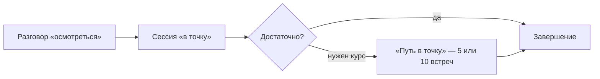

# О подходе

> Плейсхолдер-контент слоя 3: реальные тексты психолог пишет сам — это обычные
> markdown-файлы, docsify рендерит их без пересборки сайта.

Работаю короткими сфокусированными форматами: сначала разговор «осмотреться»,
затем — сессии «в точку» по одной или пакетом.

Как устроен цикл работы:

Материалы и записи — в [ленте сайта](../public.html), записаться на встречу можно
на [странице записи](../public.html#/book).

Внешние материалы открываются в новом окне: [что такое КПТ](https://ru.wikipedia.org/wiki/Когнитивно-поведенческая_психотерапия).
